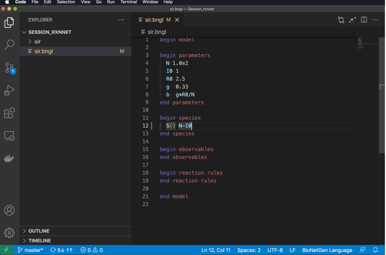
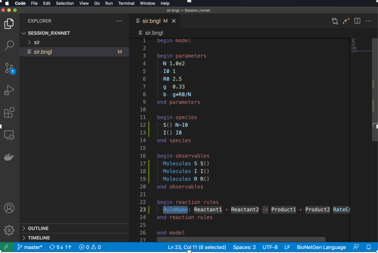

.. _lib_tut:

################
Tutorial
################

This tutorial shows how to create a BioNetGen model and simulate it.

Introduction
===============
BioNetGen is a software that allows you to model biological reaction networks in a modular, structure-based way.
It can also be used for a variety of other forms of modeling. It has a simple graph-based syntax that lets users
to create reaction models from structured objects that can bind and undergo modification.
Reaction networks models can be used to describe a wide range of natural processes in various field of sciences such as
molecular biology, chemistry and epidemiology.

First Step
===============
We encourage both new and current BioNetGen users to use VS Code extension for developing BioNetGen models. 
This extension uses PyBioNetGen, which provides Python and command-line interfaces for BioNetGen models.
Make sure you have BioNetGen properly installed by running

.. code-block:: shell

    bionetgen -h

If this command doesn't print out help information, install BioNetGen with

.. code-block:: shell

    pip install bionetgen

Creating a model
============================

Launching VS Code for the first time
======================================

1- Click on Explorer to Open a folder or create new one (or click Open in the Welcome page) as indicated in below pictures:

2- Create a new file by mousing over the directory in the Explorer or selecting New File… in Welcome as you can see in the following picture:

.. image:: Picture4.png

3- Select a name for your model and turn on autosave if you want:

4- Now it is time to start building the different parts of your BioNetGen model. 
A BioNetGen model is comprised of various blocks and action. In order to start create a bngl model, Type :code:`b` to begin:

Then Select  :code:`begin model` and some dark magic occurs. The following default structure appears:

   .. code-block:: shell

       begin model
 
       begin parameters
       end parameters

       begin molecule types
       end molecule types

       begin compartments
       end compartments

       begin species
       end species

       begin observables
       end observables

       begin functions
       end functions

       begin reaction rules
       end reaction rules

       end model

In oreder to make the text bigger, you can type ctrl-+ or command-+.

SIR Model
===========

In this example we create an SIR model describes dynamics of infection outbreak.

Parameters
===========

Type :code:`p` and select :code:`ParameterLine`, so you can enter the model parameter Names and Values as you can see below:

 .. image:: Picture8.png

 .. image:: Picture9.png

Type an entry for ParameterName and then press Tab to go to ParameterValue and enter a number. Then repeat this step for remaining parameters.

Any parameter may be defined by a math expression involving other parameters.Standard math functions (e.g., sin, cos, exp) may also be used.
As you can see on the last line we have defined the infection rate parameter in terms of the other parameters of the model.
Also, you can use Scientific notation for numbers:

Molecule types
================

Molecule types are used for defining structured species. Molecule definitions including component and compnent states.

In SIR example, there is no definition for molecule types. However, if you want to learn more about this specification, consider a receptor with the following functional substructures:
a ligand-binding site and a channel that is either open or closed. The BNG molecule type blueprint for such a molecule would be:

.. code-block:: shell

 R(lig,ch~open~closed)

:code:`R` is the name of the receptor molecule, :code:`lig` is the ligand-binding site, and :code:`ch` is the channel.
:code:`lig` is stateless, whereas :code:`ch` can take states open or closed, indicated using the tilde symbol :code:`~` .

Compartments
================

The next step is defining compartments which are used for spatial models. The compartments block is used to encode the compartment
hierarchy and compartment volumes.

There is no definition for this specification in SIR model, but if you are interested in how you can define compartment for a bngl model,
follow the below instructions:
by typing :code:`c` and selecting :code:`CompartmentLine` , you will have this default command line: 

.. code-block:: shell

  CompartmentName 2 volume ParentCompartment

Each entry indicates the name of the compartment, the dimension (2D or 3D), the volume of the compartment, and the name of the parent compartment.

Functions
================
The next step in the bngl model specification is to define functions for defining non-mass action rate laws that may be employed in your model:

Thse same as two previous parts, this specification is not used in SIR model.

Species
================
Species are used to define species that are initially present in the system and their initial concentrations. In order to add species, first
add line after begin species. Then after indenting two spaces, Type :code:`sp` and select :code:`SpeciesLine`

So, you will have a default line code like below:

Type :code:`S` followed by :code:`()` in :code:`SpeciesPattern`. The parentheses are not mandatory but are needed to make syntax highlighting work.

In the next step, type Tab and enter initial amount of  :code:`S` as :code:`N-I0`: 

Continue for :code:`I()` setting initial amount to :code:`I0`. 

Initial amounts may be given as number or math expressions involving parameters.
Initial amounts must be >= 0. Moreover, species with zero initial concentration do not need to be listed.
Units of the initial amounts are up to the user, but we strongly recommend using molecule numbers. This block can also be called :code:`SeedSpecies`.

Observables 
================
Observables define model outputs (quantities that will be included in the .gdat file produced by a simulation). Similar to the previous definitions
add line after :code:`begin observables` and after indenting two spaces, type :code:`o` and select :code:`ObservableLine`.

.. image:: Picture21.png

Then in the line select :code:`Molecules` . The type of observable affects how the set of species that match :code:`ObservablePattern` are summed. 

Type Tab and type :code:`S` followed by Tab and :code:`S()` followed by another Tab and Return to define observable :code:`S`. Repeat this steps for 
other observables (:code:`I` and :code:`R`).

Reaction Rules 
================
The actions in the model are defined by reaction rules. In order to define a new reaction rule in the model:

Add a line after :code:`begin reaction rules`
Indent two spaces
Type :code:`ru`
Select :code:`RuleLine`

Then you will have this default :code:`RuleLine`:

:code:`RuleName` is an optional string naming the reaction. In this example we select the name :code:`R1, R2, ...` 

:code:`Reactants` is a list of reactant species separated by :code: `+`

Arrow indicates whether the reaction is unidirectional :code:`( -> )` or reversible :code:`( <-> )`

:code:`Products` is a list of product species separated by :code:`+`

:code:`RateConstant` is a value, parameter or expression governing the rate law  

As an example you can find these components in the following reactions:

Actions
================
Go after the end model line. It's time to build and run the model. 
Key actions are:

:code:`generate_network` : Generate all possible species and reactions in a model.
Type :code:`g`  and Select :code:`generate_network`. Then set the overwrite option to :code:`1`

:code:`simulate`  : Generate a model trajectory using one of the built-in methods
Type :code:`si` and select simulate.

In this example we would like to use ordinary differential equation to simulat the model. So, select :code:`ode` and set :code:`t_end` to 30 
and :code:`n_steps` to 200. These parameters determine the final time point of the trajectory (starting from 0) and the number of steps to take in between.

Now we are ready to run simulation. Click on “flagman” to execute the .bngl file as indicated below:

Many things happen when we execute the model. 
1- New files are generated and displayed in the Explorer window. 

2- The files are placed in a directory named according to the date and time.

3- The :code:`.gdat` file created by the simulation is opened in a new window.

4- The TERMINAL panel shows the output of commands used to execute the model and actions requested in the .bngl file.

5- Plotting buttons appear.

Clicking on the first plot icon brings up an interactive plot of the :code:`.gdat` file data. Interactive features include:

zooming in and out
optional log scaling of either axis
turning on and off display of each variable
exporting plots to both png (image) and svg (vector) formats.

The .cdat file can also be plotted. It shows timecourses of all model species.

Stochastic Simulation
=======================
In order to perform a stochastic simulation we need to check that:

1- Species concentrations and rate constants are in counts, e.g., molecules, individuals, etc.
2- Initial concentrations have integer values (BNG will automatically round to the nearest integer, but if this is zero the model may not behave as expected.

We will set R0 to 1.2 and modify the simulate command as follows:

First change method from :code:`ode` to :code:`ssa`.

Then add the parameter :code:`seed` to the arguments and set its value to :code:`1`. This is the value used to seed the random number generator and
ensures that we will get the same trajectory each time we run the simulation, which is useful for debugging models.

Then use the flagman to run the simulation. Here are plots showing stochastic trajectories for three different seed values. 

    
