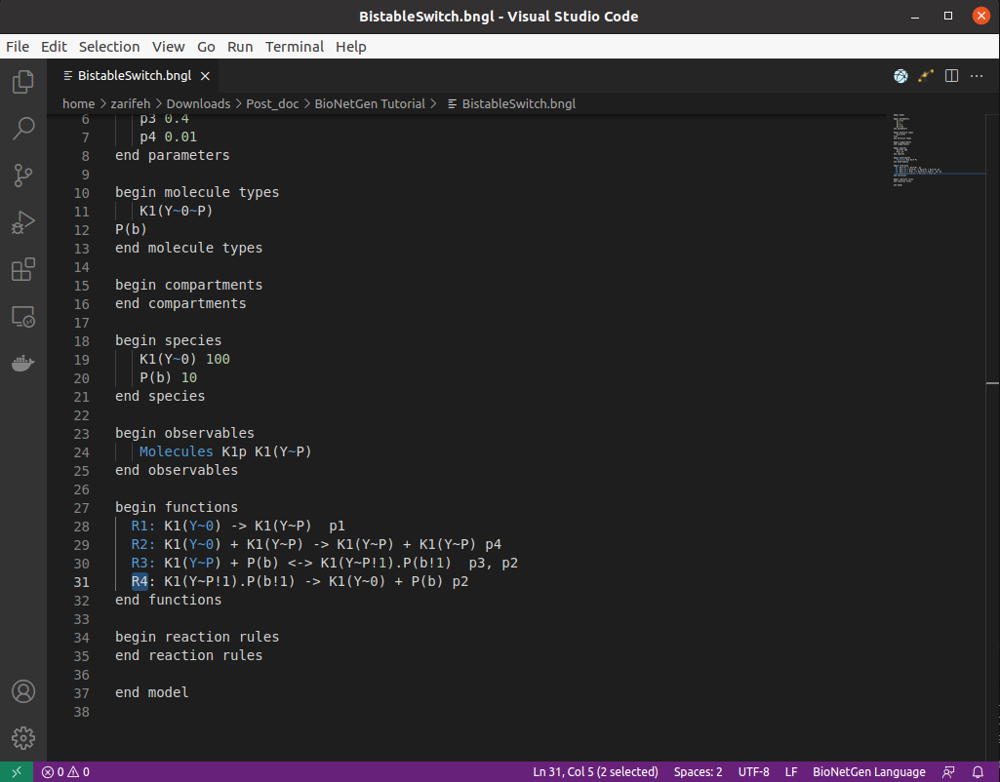
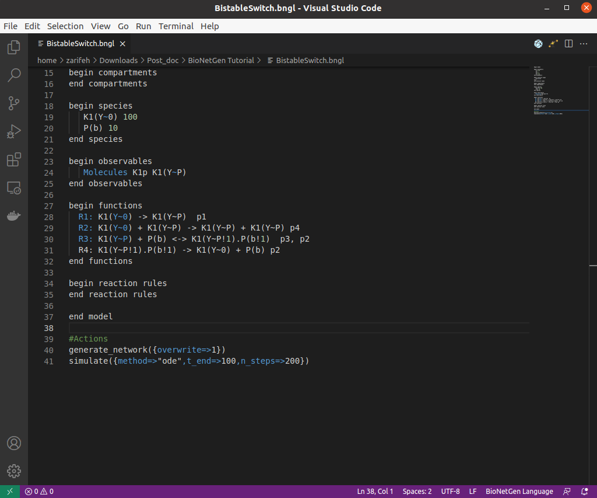
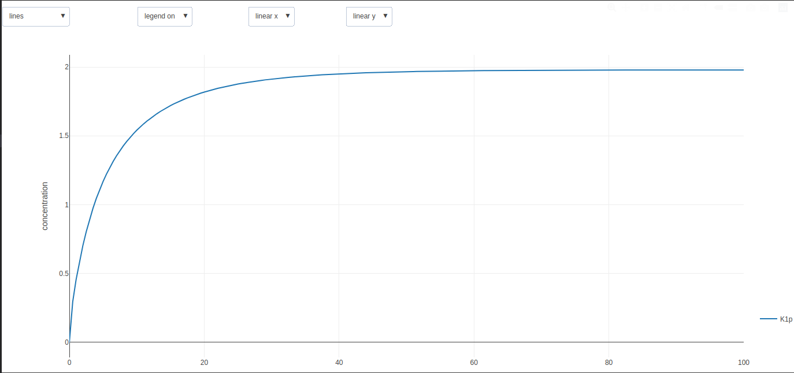

##################
BioNetGen Example 
##################

Biastable Switch Example
==========================

In this example, we will try to focuse on more details in BioNetGen modeling. We consider a simple four reactions network which illustrates a switch 
including two enzymes, a kinase and a phosphatase. The main reason of presenting this example is describing how to define the components and states of the molecules.
The main network of reactions in this model is depicted in the image below, which was taken from the original study. You can find the paper `here <https://www.pnas.org/doi/10.1073/pnas.82.9.3055>`_

 .. image:: Picture-Switch1.png

The network is a bistable switch which is constructed from two proteins: kinase-1, which can exist in either an inactive state (K1) or an active state (Kfp)
and a phosphatase. The transition between inactive and active states is due to a phosphorylation reaction that can be catalyzed by active kinase-1 or by the
kinase-2 activated.

Let's start the BioNetGen modeling of this network. After creating a new bngl file and its naming, Type :code:`b` and select :code:`begin model`.
Then you will have a default modeling lines as:

 .. code-block:: shell

      begin model

      begin parameters
  
      end parameters

      begin molecule types
      end molecule types

      begin compartments
      end compartments

      begin species
      end species

      begin observables
      end observables

      begin functions
      end functions

      begin reaction rules
      end reaction rules

      end model

Parameters
===========

Between the :code:`begin parameter` and :code:`end parameter`, we can define the parameters of the model. Type :code:`p` and select :code:`ParameterLine`:

 .. image:: Picture-Switch2.png

so you can enter the model parameter Names and Values as you can see below:

 .. image:: Picture-Switch3.png

Molecule Types
===============

Between the :code:`begine molecule types` and :code:`end molecule types`, we can define the reactants of the model. Type :code:`m` and select :code:`Molecules`:

 .. image:: Picture-Switch4.png

In this structure, we can define a molecule type and its components, as well as component states. For a molecule to be able to bind another molecule
or undergo some type of status changes, at least one component must be defined.

 .. image:: Picture-Switch5.png

In this example, :code:`K1(Y~0~P)` shows molecule :code:`K1` which can be in two different states: :code:`K1(Y~P)` (phosphorylated or active) and :code:`K1(Y~0)` (unphosphorylated or inactive).

Compartments
================

The next step is defining compartments which are used for spatial models. The compartments block is used to encode the compartment
hierarchy and compartment volumes. There is no definition for this specification in this model, but if you are interested in how you can define compartment for a bngl model,
follow the below instructions:
by typing :code:`c` and selecting :code:`CompartmentLine` , you will have this default command line: 

.. code-block:: shell

  CompartmentName 2 volume ParentCompartment

Each entry indicates the name of the compartment, the dimension (2D or 3D), the volume of the compartment, and the name of the parent compartment.

Species
=========

Species are used to define species that are initially present in the system and their initial concentrations. In order to add species, first
add line after :code:`begin species`. Then after indenting two spaces, Type :code:`sp` and select :code:`SpeciesLine`:

 .. image:: Picture-Switch6.png

for this example, we define the species as follows:

 .. image:: Picture-Switch7.png

Observables 
================

Observables define model outputs (quantities that will be included in the .gdat file produced by a simulation). Similar to the previous definitions
add line after :code:`begin observables` and after indenting two spaces, type :code:`o` and select :code:`ObservableLine`.

 .. image:: Picture-Switch8.png

Then, we can define the observables as the picture below:

 .. image:: Picture-Switch9.png

Functions
================
The next step in the bngl model specification is to define functions for defining non-mass action rate laws that may be employed in your model.
This specification is not used in this model.       

Reaction Rules 
================

The actions in the model are defined by reaction rules. In order to define a new reaction rule in the model:

1- Add a line after :code:`begin reaction rules`

2- Indent two spaces

3- Type :code:`ru`

4- Select :code:`RuleLine`     

The reaction rules in this model includes:

  :code:`R1` : Phosphorylation of :code:`K1`

  :code:`R2` : Intermolecular autophosphorylation or Autocatalyticall phosphorylation of other kinase-1 molecules via :code:`K1(Y~P)`

  :code:`R3` : Binding and unbinding the :code:`K1(Y~P)` and :code:`P(b)`

  :code:`R4` : Dephosphorylation mediated by the phosphatase or Inactivation of :code:`K1(Y~P)` via :code:`P(b)`

Actions
=========

Go after the end model line. It's time to build and run the model. 
Key actions are:

:code:`generate_network` : Generate all possible species and reactions in a model.
Type :code:`g`  and Select :code:`generate_network`. Then set the overwrite option to :code:`1`

:code:`simulate`  : Generate a model trajectory using one of the built-in methods
Type :code:`si` and select simulate.

In this example we would like to use ordinary differential equation to simulat the model. So, select :code:`ode` and set :code:`t_end` to 100 
and :code:`n_steps` to 200. These parameters determine the final time point of the trajectory (starting from 0) and the number of steps to take in between.

Now we are ready to run simulation. Click on “flagman” to execute the .bngl file. 
Then, the files are placed in a directory named according to the date and time.
Clicking on the  :code:`.gdat` file data and the first plot icon brings up an interactive plot of the output.

Interactive features include:

zooming in and out

optional log scaling of either axis

turning on and off display of each variable

exporting plots to both png (image) and svg (vector) formats

